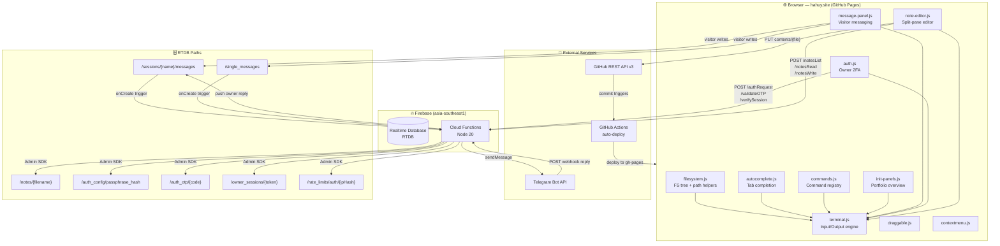
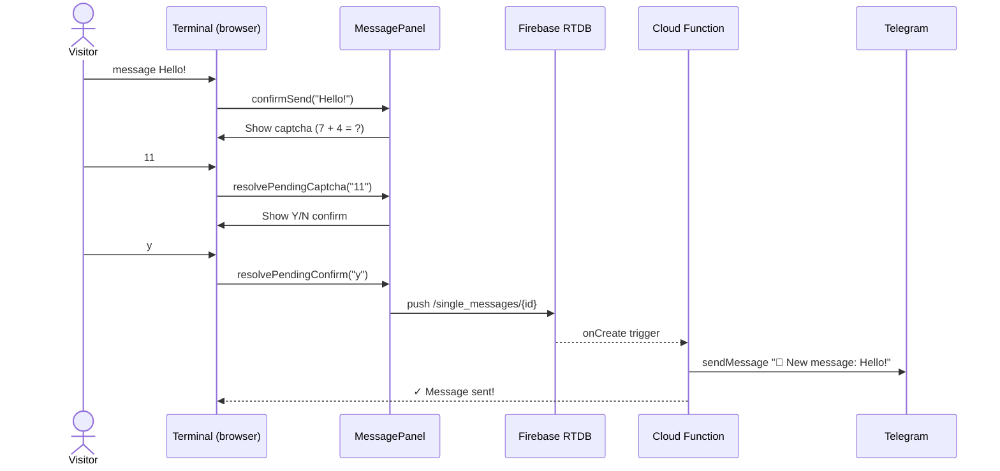
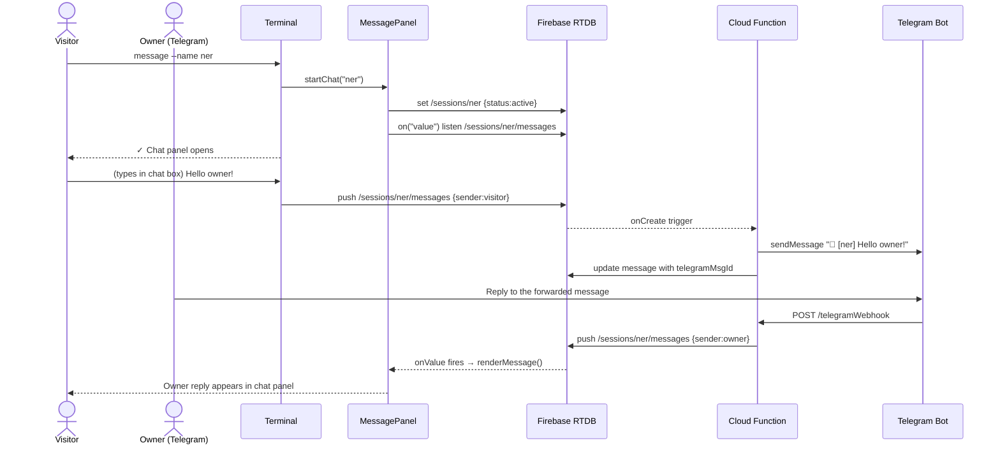
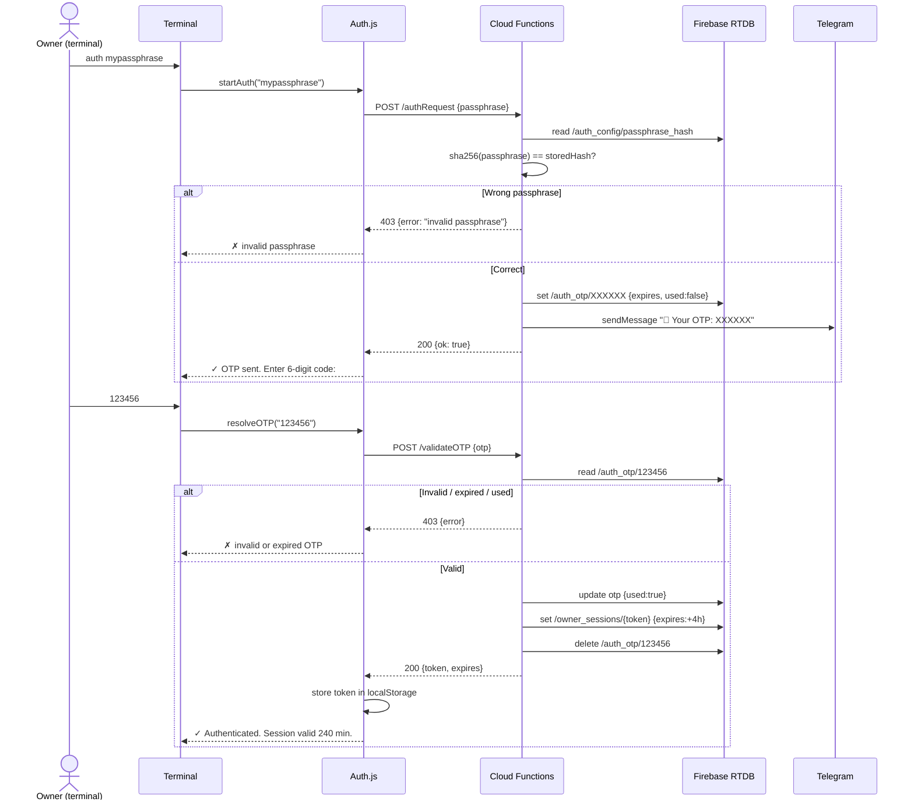
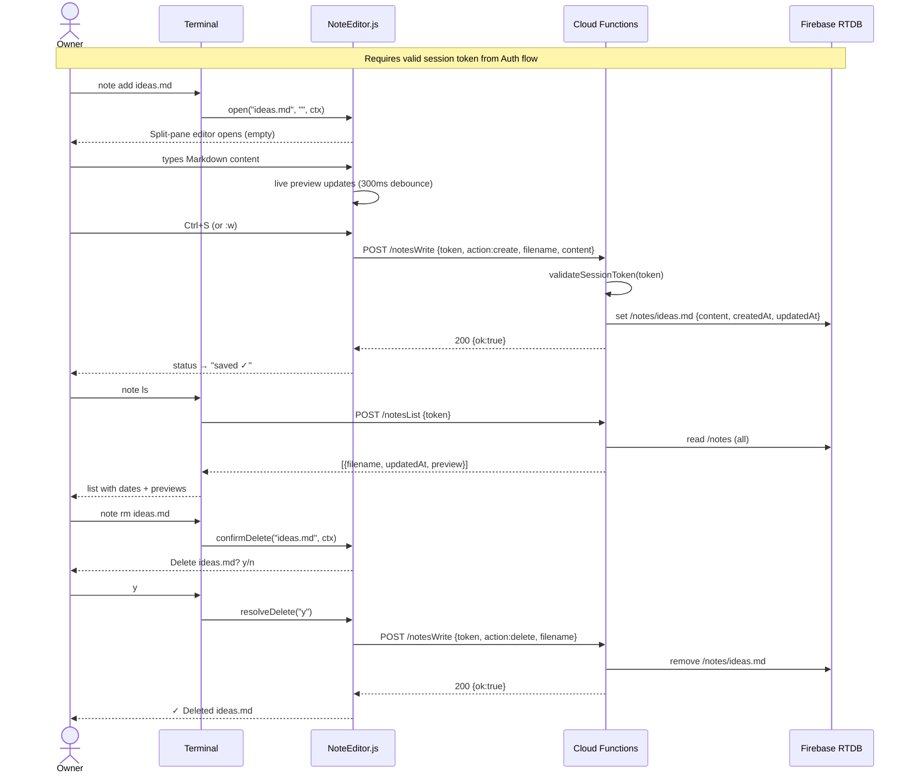
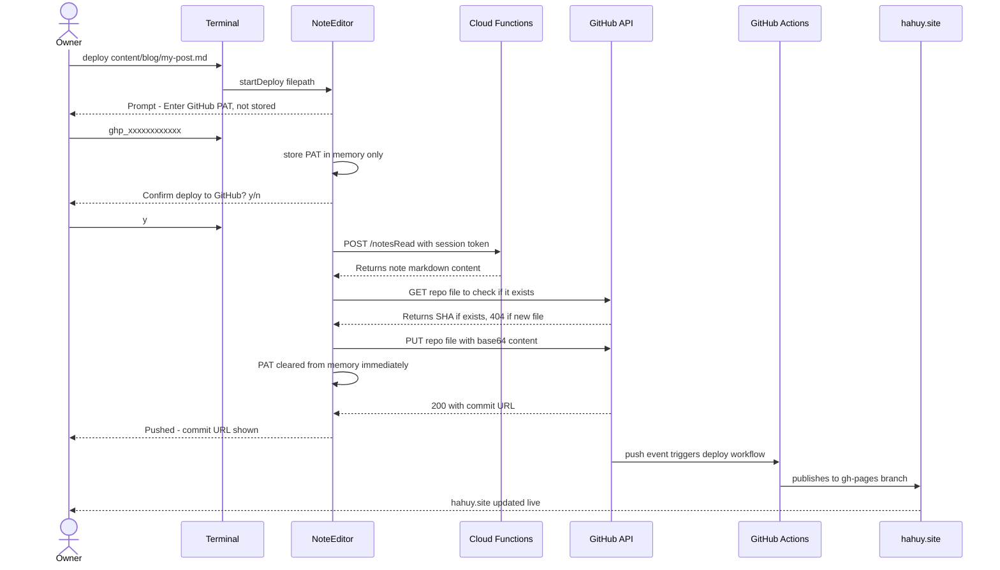
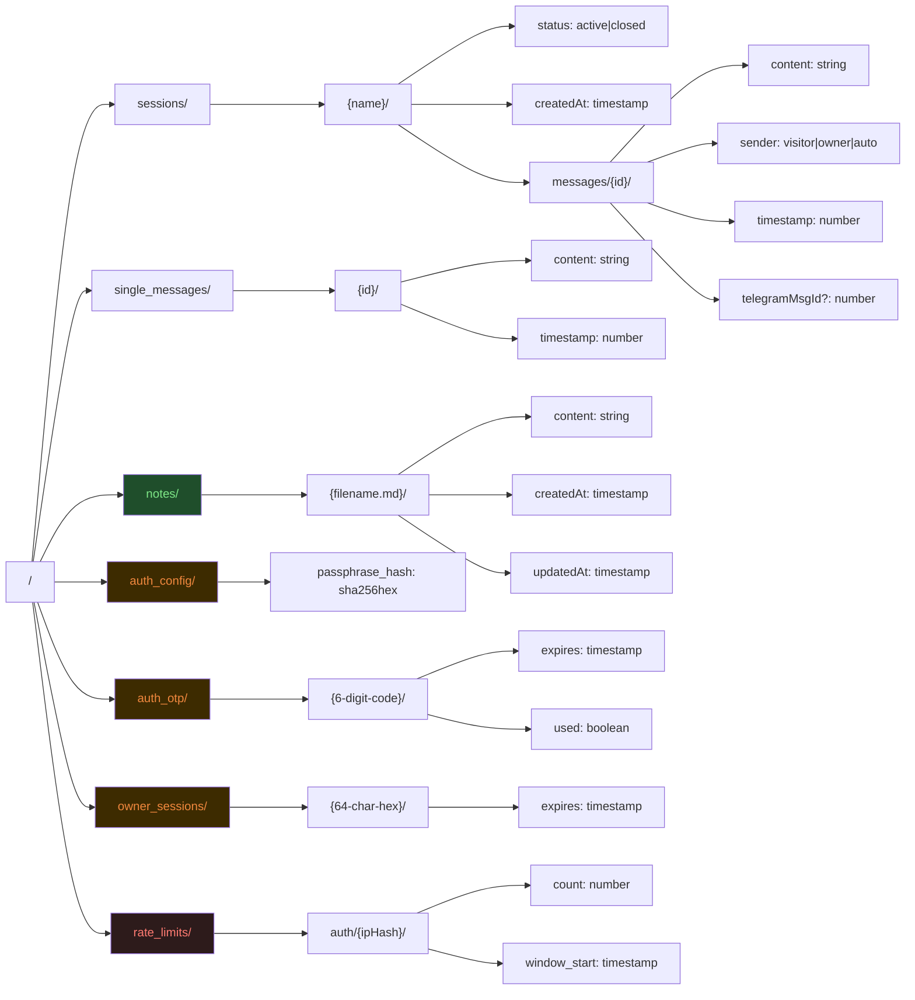
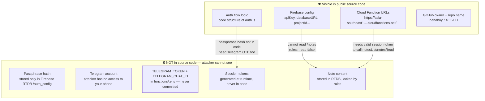
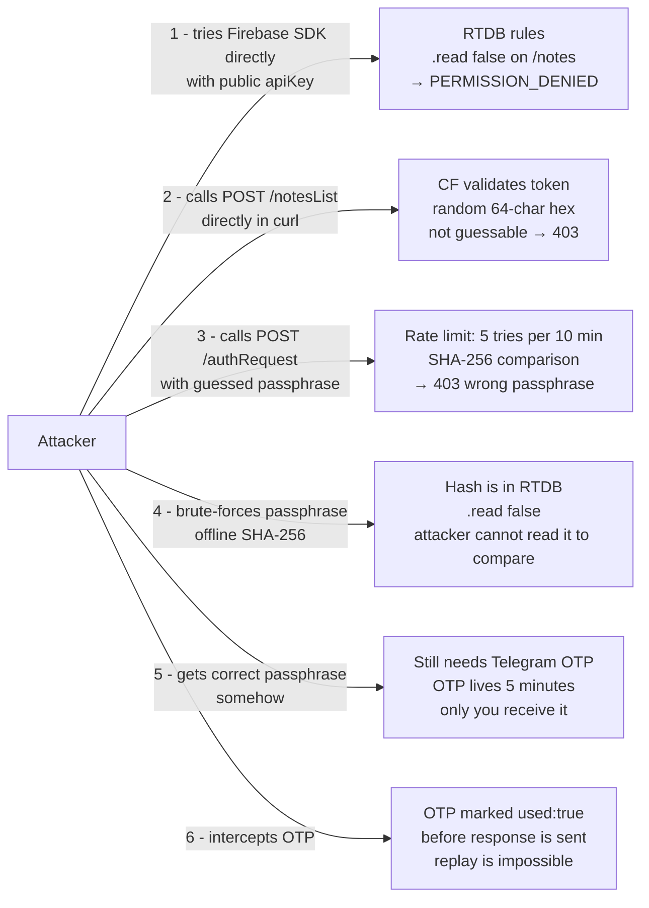
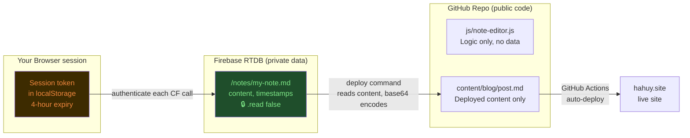

# 4FF-HH — System Architecture

> Full system map for the terminal portfolio at **hahuy.site**.
> Zero npm dependencies on the frontend. Firebase Spark free tier.

---

## 1 · Overall System Architecture



---

## 2 · Visitor Message Flow



---

## 3 · Live Chat Flow



---

## 4 · Owner Auth Flow (2FA)



---

## 5 · Notes CRUD Flow



---

## 6 · GitHub Deploy Flow



---

## 7 · Firebase RTDB Data Structure



> **RTDB Rules summary:**
> - `sessions`, `single_messages` — visitor-writable (with validate rules)
> - `notes`, `auth_config`, `auth_otp`, `owner_sessions`, `rate_limits` — **`.read: false, .write: false`** (Admin SDK only)

---

## 8 · Why Source Code Exposure Doesn't Expose Your Data

> This repo is public. Anyone can read every line of JS. Here is exactly what they can see and why it still protects your notes.

### What an attacker sees in the source code



### Layer-by-layer breakdown



### Firebase API key — why it is safe to be public

The Firebase `apiKey` in `message-panel.js` is **not a secret**. It is a project identifier, not a password.

| What `apiKey` controls | What actually controls access |
|---|---|
| Identifies which Firebase project to talk to | Firebase RTDB security rules |
| Allows calling the Firebase SDK | `.read` / `.write` rules on each path |
| Required to be public for web apps | Admin SDK (Cloud Functions) bypasses client rules |

Anyone with the `apiKey` can attempt reads and writes. The RTDB rules are what block them:

```
/notes → .read: false, .write: false
         → blocked for ALL clients regardless of apiKey
         → only Cloud Functions (Admin SDK) can access
```

### The GitHub "drive" data flow — where data actually lives



**Key insight:** The repo contains *logic*. The data lives in Firebase RTDB behind server-side rules that no amount of source code reading can bypass. The `deploy` command is a one-way export — it takes private note content and publishes it to the repo only when *you* explicitly trigger it with a PAT that you type, use once, and is immediately cleared from memory.

### What GitHub PAT protects

The PAT is never stored anywhere — not in code, not in Firebase, not in localStorage:

```
deploy command triggers
  → you type PAT into terminal input
  → PAT held in JS variable _githubPAT (memory only)
  → one PUT request to GitHub API
  → _githubPAT = null  (same function, next line)
  → Ctrl+L clears terminal output (PAT never visible in DOM after clear)
```

The only person who can deploy a note to the repo is someone who:
1. Knows your passphrase (not in source code)
2. Has access to your Telegram (physical device)
3. Has a GitHub PAT with `repo` scope (generated by you in GitHub settings)

